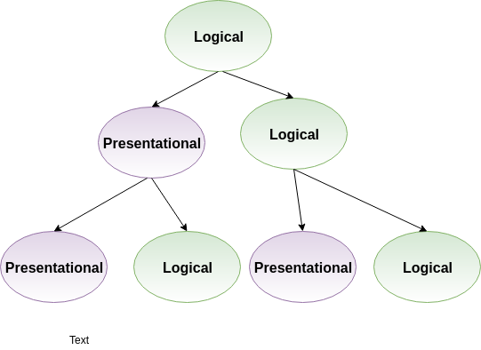

@title[Introduction]

## Testing Smart in React
#### Pramod Jacob

---

### Questions We'll Answer

- What React best practices can we follow to make testing easier?
- What mentality should we have when we approach testing with React?
- How should we balance **unit tests**, **"integration" tests**, and **end-to-end tests**?

Note:
"Integration  " in quotes because it's definition is super vague, esp in React. It could mean integration between components or integration with external systems.

---

### Testing in JavaScript and React Isn't Easy

- Async behavior (i.e. promises)
- The inherent complexity of user interfaces
- Handling external calls with mocks
- Complex component composition/hierarchy (something in our control)

Note:
- It's just not as simple as the "black-box" testing scenarios in our Rails code.
- How we compose our components will determine whether our tests are simple or complex

+++

### So How Can We Make Testing Easier?

- Understand how we can distinguish "smart" and "dumb" components
- Understand our testing tools
- Use the right tools for specific testing scenarios
- **Prefer testing behavior over focused logic**

Note:
That last point is applicable to all testing, not just JS/React

---

### React Best Practices

+++

### Smart versus Dumb Components

+++

### Dumb Components

- Also called *presentational components*
- Deal completely with the look of components (elements, style, etc)
- Usually stateless and functional
- Not connected to any stores (Redux, Mobx, etc)

Note:
Addendum - can have some state pertaining to UI

+++

### Smart Components

- Also called *container components* or *logical components*
- Handle the UI logic - what to render, when, where, etc
- Usually stateful & class-based
- Connected to stores

Note:
Smart & dumb terminology kind of mean (Dan Abramov opposes it)
More memorable, however

+++

---

### What About Snapshot Tests?

"Snapshot testing entails an admission of defeat in capturing the essential details of a component: instead we capture them all." - [Visual Testing Handbook](https://www.chromaticqa.com/book/visual-testing-handbook)

---

### Understanding Jest

+++?code=code/jestExample.js&lang=javascript

---

### End to End Tests with Cypress

- ???

---

### Sources

- [An Overview of JavaScript Testing in 2018](https://medium.com/welldone-software/an-overview-of-javascript-testing-in-2018-f68950900bc3)

- [Visual Testing Handbook](https://www.chromaticqa.com/book/visual-testing-handbook)

- [The Right Way to Test React Components](https://medium.freecodecamp.org/the-right-way-to-test-react-components-548a4736ab22s)

- [Presentational and Container Components](https://medium.com/@dan_abramov/smart-and-dumb-components-7ca2f9a7c7d0)
