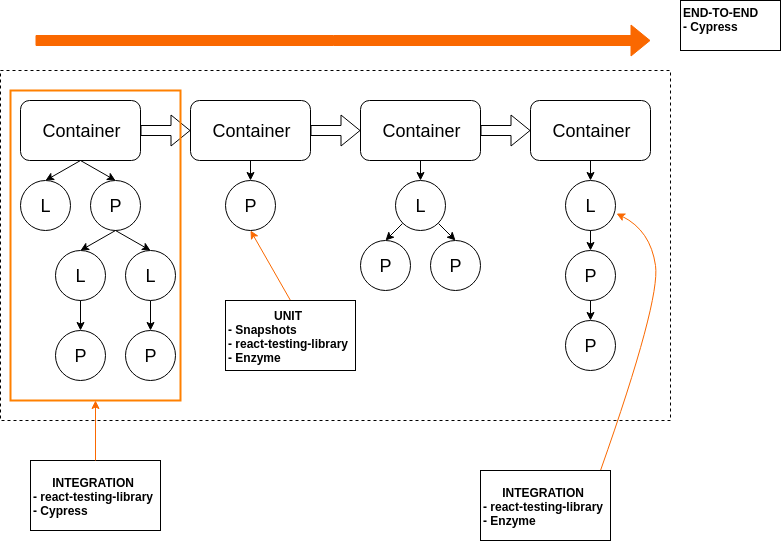

@title[Introduction]

## React Testing
#### Pramod Jacob

---

### Questions We'll Answer

- What React best practices can we follow to make testing easier?
- What mentality should we have when we approach testing with React?
- What are unit tests like in react? What about integration tests?
- What tools do we have at our disposal?
- What will our end-to-end tests look like?

---

### Testing in JavaScript and React Isn't Easy

- Async behavior (i.e. promises)
- The inherent complexity of user interfaces
- Handling external calls
- (Possibly) complex component composition/hierarchy

Note:
- It's just not as simple as the "black-box" testing scenarios in our Rails code.
- How we compose our components will determine whether our tests are simple or complex

+++

### How Tests Look Now

- Tons of snapshots, many of which aren't super useful
- High amount of unit tests that checks implementation over anything else
- Direct props & state checks
- Few tests that check component orchestration

Note:
To boost our test coverage

+++

We don't have many big-picture tests.

+++

### So How Can We Make Testing Easier?

- Understand logical "smart" components and presentational "dumb" components
- Understand the intricacies of JavaScript and React testing
- Use the right testing tools for specific testing scenarios
- **Prefer testing behavior over focused logic**

Note:
That last point is applicable to all testing, not just JS/React

---

### Smart vs Dumb Components

+++

### Dumb Components

- Also called *presentational components*
- Deal completely with the look of components (elements, style, etc)
- Usually stateless and functional
- Usually not connected to any stores (Redux, Mobx, etc)

Note:
Addendum - can have some state pertaining to UI

+++

### Smart Components

- Also called *container components* or *logical components*
- Handle the UI logic - what to render, when, where, etc
- Usually stateful & class-based
- Usually connected to stores

Note:
Smart & dumb terminology kind of mean (Dan Abramov opposes it)
More memorable, however

+++?code=code/logicalComponent.js&lang=javascript&title=Smart Component: Example

@[9-12](Stateful)
@[6](Declared as a class)
@[1-32](Connected to a store)

+++?code=code/presentationComponent.js&lang=javascript&title=Dumb Component: Example

@[3](Just props, no state)
@[3](Declared as a function)
@[11](Not connected to any stores)

+++

### myUSCIS Example

Note:
ElisEvidenceUpload && FileUpload

+++

+++

Separating components into logical & presentational components is not a hard & fast rule. It's just an ideal to strive for.

Note:
It's not always super straightforward to determine what components should be "smart" and what should be "dumb". Just do the best you can.

---

### I Have Smart & Dumb Components - Now What?

Let's think about what each component does!

Note:
Or at least you've tried to separate them as much as possible.

---

### Component Contracts

+++

@quote[A contract defines the expected behavior of your component and what assumptions are reasonable to have about its usage.](The Right Way to Test React Components)

+++

### Component Contracts

- What does it render?
- What props does the component receive? How does it react to changes in props?
- What state does the component hold? How does it react to changes in state?
- When the user interacts with the component, what happens?

Note:
This is a tool to help us really understand what our component does.

+++

What does a contract look like for a typical "smart" component? What about a typical "dumb" one?

+++

### "Dumb" Component Contracts

- I **definitely** care about how this component renders
- I care about props and how the component reacts when props change
- The component is most likely stateless, so I'm not worried about changes in state
- The component might not have its own behavior, but I at least have to make sure that passed-in callbacks are called
- I care about this component as a **unit**

+++

### "Smart" Component Contracts

- I care about how this component renders
- I care about how this component reacts to changes in both props **and** state
- I care about the children of this component and how they behave
- I have to think about the behavior of this component and all of it's children
- I care about the **integration details** and **overall behavior** of this component

---

### Unit vs Integration Tests

- Unit: Testing the functionality and behavior of a **single** component in isolation
  - Usually "black box" tests
- Integration: Testing the functionality and behavior of **multiple** components as they interact with one another
  - Usually focused more on overall behavior instead of implementation details

Note:
These are my personal definitions of unit & integration tests in React.

+++

As we go through this talk, the line between component unit tests and integration tests will blur significantly - but that's okay!

---

### Render Testing: The Simplest Unit Test

Note:
Let's start with the simplest case that is clearly more of an integration test.
These are our simplest unit tests because we can simply pass in props and check for changes.
It's the closest thing we have in the front end to a real "black box" test.

+++

This is where snapshot tests come in handy! But...

+++

@quote[Snapshot testing entails an admission of defeat in capturing the essential details of a component: instead we capture them all.](Visual Testing Handbook)

+++

Does this mean you should never use snapshot tests?

+++

**No.** In fact, they can be extremely useful to test presentational components (if used properly).

Note:
Snapshot tests absolutely have their place in any React test suite, but be careful not to use them as a "cop out" test to boost your test coverage.
They are great for testing branching conditional scenarios in presentational components.

---

### Blurring the Lines: Testing Props and State

+++

We don't want to test props and state directly. Instead, we want to test the **reactions** of props and state changes.

Note:
Remember - we're testing behavior, not implementations

+++?code=code/fileUpload.js&lang=javascript

+++?code=code/fileDisplay.js&lang=javascript

+++?code=code/fileUploadTestNo.js&lang=javascript&title=Test Method 1 (Not Recommended)

Note:
Written in Jest and faux-Enzyme (real Enzyme coming later)
This isn't helpful because we don't know that the UI has reacted properly to a change in state

+++?code=code/fileUploadTestYes.js&lang=javascript&title=Test Method 2 (Recommended)

Note:
Written in Jest and faux-rtl (real rtl coming later)
This is much better because we are testing if the UI has reacted properly to a change in state

+++

Similarly, we do not want to check the value of props in tests - we want to test how the component behaves when the prop changes.

Note:
In fact, checking to see that a prop was passed is tantamount to testing the implementation of React

---

### The Tools at our Disposal

+++

### Jest

- The testing framework that powers all of our tests
- Gives us some useful mechanisms for assertsions and mocking
- Plain old Jest is sometimes all we need!

+++

### Enzyme

- Directly tests the implementation of React components
- Gives you mechanisms to check for rendered components, elements,
- Provides methods to check for props and state directly

+++

### Enzyme

- Directly tests the implementation of React components
- Gives you mechanisms to check for rendered components, elements,
- Provides methods to check for props and state directly
- **Often a painful experience**

+++

### Enzyme Pain Points

- [Differentiating between shallow & mount is frustrating](https://gist.github.com/fokusferit/e4558d384e4e9cab95d04e5f35d4f913)
- Confusing API at times
- Polynomial relationship between component complexity & test complexity
- Far too implementation-heavy, not as behavior-focused

Note:
I should not have to care about whether to use shallow or mount
Behavior-focused testing is possible, however.

+++

[Enzyme Documentation](https://airbnb.io/enzyme/)

---

### Are There Alternatives?

+++

### Yes! [react-testing-library](https://github.com/kentcdodds/react-testing-library)

+++

@quote[The more your tests resemble the way your software is used, the more confidence they can give you.](Kent Dodds)

Note:
react-testing-library was built with behavior in mind, instead of React's implementation

+++?code=code/fileUploadTestYes.js&lang=javascript&title=Previous pseudo-implementation of FileUpload

+++?code=code/fileUploadTestRTL.js&lang=javascript&title=Testing FileUpload with react-testing-library

+++

### Benefits of react-testing-library over Enzyme

- Only one render option (no shallow versus mount debates)
- Useful error messages
- Well supported
- Tests behavior and integration instead of specific implementations

+++

Is react-testing-library a complete replacement for Enzyme?

+++

Yes.

+++

Just kidding, no.

+++

There are times when you have to care about the specific value of state instead of changes in the DOM. But a vast majority of scenarios can and should be covered by react-testing-library.

+++

Quick note: react-testing-library is also not a replacement for powerful end-to-end testing frameworks like Cypress and Puppeteer.

Note:
Example is the prior spouse history table

---

### Revisiting Unit vs Integration

Unit tests are not quite as useful in React as they are in other frameworks
  - UIs are simply too complicated to benefit significantly from unit tests like snapshots

+++

### Revisiting Unit vs Integration

Integration tests are more useful because they prefer behavior over implementation details

+++

### Revisiting Unit vs Integration

**We should aim to write tests that focus on behavior, not implementation**.

Note:
If you walk away with one thing, walk away with that last statement.

---

### End to End Tests with Cypress

- Powerful and easy-to-use
- Alternative to Selenium, which powers our Cucumber tests
- Simple, straightforward DSL
- Excellent debugger tools (snapshots, time travel)
- More details forthcoming!

+++?code=code/cypress.js&lang=javascript&title=Cypress Example from Docs

---

+++

We should re-evaluate the testing pyramid

---

### Other Useful React Testing Rules

- Don't test third-party libraries
- Don't test proptypes
- Unit-test JavaScript "utility" functions using plain old Jest
- Take some time to understand the async nature of JavaScript

Note:
- I don't think most people here will test third-party libraries directly - but be careful not to test them accidentally
- Testing proptypes is testing the implementation of a third-party library
- If I had time, I would 100% talk more about JS async

---

### Sources

- [An Overview of JavaScript Testing in 2018](https://medium.com/welldone-software/an-overview-of-javascript-testing-in-2018-f68950900bc3)

- [Visual Testing Handbook](https://www.chromaticqa.com/book/visual-testing-handbook)

- [The Right Way to Test React Components](https://medium.freecodecamp.org/the-right-way-to-test-react-components-548a4736ab22s)

- [Presentational and Container Components](https://medium.com/@dan_abramov/smart-and-dumb-components-7ca2f9a7c7d0)
