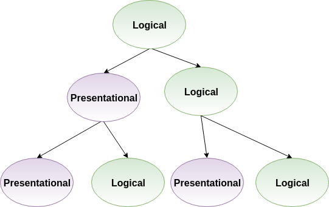

@title[Introduction]

## React Testing
#### Pramod Jacob

---

### Questions We'll Answer

- What React best practices can we follow to make testing easier?
- What mentality should we have when we approach testing with React?
- What are unit tests like in react? What about integration tests?
- What tools do we have at our disposal?
- Can I get a taste of what end to end tests are like?

Note:
"Integration" in quotes because it's definition is super vague, esp in React. It could mean integration between components or integration with external systems.

---

### Testing in JavaScript and React Isn't Easy

- Async behavior (i.e. promises)
- The inherent complexity of user interfaces
- Handling external calls
- Complex component composition/hierarchy

Note:
- It's just not as simple as the "black-box" testing scenarios in our Rails code.
- How we compose our components will determine whether our tests are simple or complex

+++

### So How Can We Make Testing Easier?

- Understand a particular best practice for creating React components
- Understand the core principles of JavaScript and React testing
- Use the right testing tools for specific testing scenarios
- **Prefer testing behavior over focused logic**

Note:
That last point is applicable to all testing, not just JS/React

---

### Smart vs Dumb Components

+++

### Dumb Components

- Also called *presentational components*
- Deal completely with the look of components (elements, style, etc)
- Usually stateless and functional
- Usually not connected to any stores (Redux, Mobx, etc)

Note:
Addendum - can have some state pertaining to UI

+++

### Smart Components

- Also called *container components* or *logical components*
- Handle the UI logic - what to render, when, where, etc
- Usually stateful & class-based
- Usually connected to stores

Note:
Smart & dumb terminology kind of mean (Dan Abramov opposes it)
More memorable, however

+++?code=code/logicalComponent.js&lang=javascript&title=Smart Component: Example

@[9-12](Stateful)
@[6](Declared as a class)
@[1-32](Connected to a store)

+++?code=code/presentationComponent.js&lang=javascript&title=Dumb Component: Example

@[3](Just props, no state)
@[3](Declared as a function)
@[11](Not connected to any stores)

+++

### myUSCIS Example

Note:
ElisEvidenceUpload && FileUpload

+++

+++

Separating components into Logical & Presentational components is not a hard & fast rule. It's just an ideal to strive for.

---

### I Have Smart & Dumb Components - Now What?

Now we are in a good place to think about testing!

Note:
Or at least you've tried to separate them as much as possible.

---

### Unit vs Integration

- Unit: Testing the functionality and behavior of a **single** component
- Integration: Testing the functionality and behavior of **multiple** components as they interact with one another

Note:
These are my personal definitions of unit & integration tests in React.

+++

### Unit vs Integration

- Unit: Testing the functionality and behavior of a **single** component
  - Presentational, or "dumb" components
- Integration: Testing the functionality and behavior of **multiple** components as they interact with one another
  - Logical/container, or "smart" components

+++

Differentiating between smart and dumb components has made it easy for us to determine what type of tests to run for each component.

Note:
This is a good start, but let's keep digging to really understand the React testing mentality.

---

### Component Contracts

+++

@quote[Understanding a component’s contract is the most important part of testing a React component. A contract defines the expected behavior of your component and what assumptions are reasonable to have about its usage.](The Right Way to Test React Components)

+++

### Component Contracts

- What does it render?
- What props does the component receive? How does it react to changes in props?
- What state does the component hold? How does it react to changes in state?
- When the user interacts with the component, what happens?

---

### Testing Renders

+++

- These are our barebones simplest unit tests
- This is where snapshot tests come in handy!

+++

@quote[Snapshot testing entails an admission of defeat in capturing the essential details of a component: instead we capture them all.](Visual Testing Handbook)

+++

Does this mean you should never use snapshot tests?

+++

**No.** In fact, they can be extremely useful to test presentational components (if used properly).

Note:
Snapshot tests absolutely have their place in any React test suite, but be careful not to use them as a "cop out" test to boost your test coverage.
They are great for testing branching conditional scenarios in presentational components.

+++

---

### Testing Props and State

+++

Avoid testing props and state directly. Instead, test the **reactions** of props and state changes.

Note:
Remember - we're testing behavior, not implementations

+++?code=code/fileUpload.js&lang=javascript

+++?code=code/fileDisplay.js&lang=javascript

+++?code=code/fileUploadTestNo.js&lang=javascript&title=Test Method 1 (Not Recommended)

Note:
Written in Jest and faux-Enzyme (real Enzyme coming later)
This isn't helpful because we don't know that the UI has reacted properly to a change in state

+++?code=code/fileUploadTestYes.js&lang=javascript&title=Test Method 2 (Recommended)

Note:
Written in Jest and faux-rtl (real rtl coming later)
This is much better because we are testing if the UI has reacted properly to a change in state

+++

These principles also apply to testing changes in props

Note:
In fact, checking to see that a prop was passed is tantamount to testing the implementation of React

---

### Tools for Testing Behavior?

+++

### Testing with Enzyme

- Directly tests the implementation of React components
- Gives you mechanisms to check for rendered components, elements,
- Provides methods to check for props and state directly

+++

### Testing with Enzyme

- Directly tests the implementation of React components
- Gives you mechanisms to check for rendered components, elements,
- Provides methods to check for props and state directly
- **Often a painful experience**

+++

### Enzyme Pain Points

- [Differentiating between shallow & mount is frustrating](https://gist.github.com/fokusferit/e4558d384e4e9cab95d04e5f35d4f913)
- Confusing API at times
- Polynomial relationship between component complexity & test complexity
- Far too implementation-heavy, not as behavior-focused

Note:
I should not have to care about whether to use shallow or mount
Behavior-focused testing is possible, however.

+++

[Enzyme Documentation](https://airbnb.io/enzyme/)

---

### Are There Alternatives?

+++

### Yes! [react-testing-library](https://github.com/kentcdodds/react-testing-library)

+++

@quote[The more your tests resemble the way your software is used, the more confidence they can give you.](Kent Dodds)

Note:
react-testing-library was built with behavior in mind, instead of React's implementation

+++?code=code/fileUploadTestYes.js&lang=javascript&title=Previous pseudo-implementation of FileUpload

+++?code=code/fileUploadTestRTL.js&lang=javascript&title=Testing FileUpload with react-testing-library

+++

### Benefits of react-testing-library over Enzyme

- Tests behavior and UI changes instead of React implementation
- Only one render option (no shallow versus mount debates)
- Useful error messages

+++

Unfortunately, react-testing-library is not a complete replacement for Enzyme. However, it should be used for a significant majority of unit & integration tests.

---

### End to End Tests with Cypress

- Powerful and easy-to-use
- Alternative to Selenium, which powers our Cucumber tests
- Simple, straightforward DSL
- Excellent debugger tools (snapshots, time travel)
- More details forthcoming!

+++?code=code/cypress.js&lang=javascript&title=Cypress Example from Docs

---

---

### Other Useful React Testing Rules

- Don't test third-party libraries
- Don't test proptypes

Note:
- I don't think most people here will test third-party libraries directly - but be careful not to test them accidentally
- Testing proptypes is testing the implementation of a third-party library

---

### Sources

- [An Overview of JavaScript Testing in 2018](https://medium.com/welldone-software/an-overview-of-javascript-testing-in-2018-f68950900bc3)

- [Visual Testing Handbook](https://www.chromaticqa.com/book/visual-testing-handbook)

- [The Right Way to Test React Components](https://medium.freecodecamp.org/the-right-way-to-test-react-components-548a4736ab22s)

- [Presentational and Container Components](https://medium.com/@dan_abramov/smart-and-dumb-components-7ca2f9a7c7d0)
